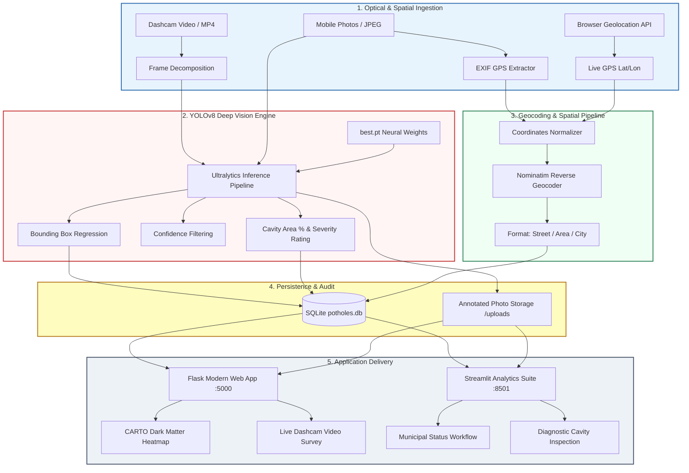
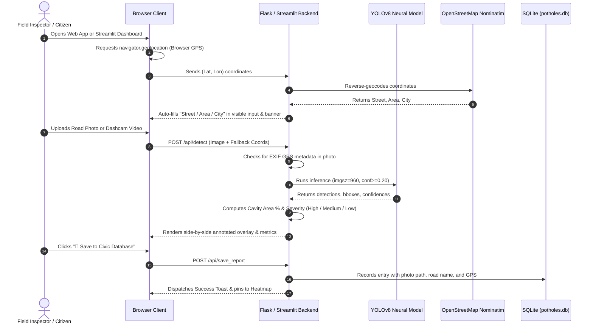

# 🛣️ CivicRoad AI — Intelligent Pothole Detection & Civic Infrastructure Intelligence

[](https://www.python.org/)
[](https://github.com/ultralytics/ultralytics)
[](https://pytorch.org/)
[](https://flask.palletsprojects.com/)
[](https://streamlit.io/)
[](https://carto.com/)
[](LICENSE)

**CivicRoad AI** is an end-to-end municipal road inspection and infrastructure intelligence platform. Powered by custom-trained **YOLOv8 neural networks**, it automatically detects road cavities and asphalt depressions from smartphone images, dashcam feeds, and video surveys, geolocates damage via **Live Browser GPS** and **camera EXIF metadata**, reverse-geocodes exact **`Street / Area / City`** addresses, and streams actionable telemetry into high-density **civic heatmaps** and an SQLite database.

---

## 🌟 Key Highlights & Capabilities

- 👁️ **State-of-the-Art Deep Learning Detection**: Custom YOLOv8 model (`best.pt`) optimized for Indian and global asphalt conditions, detecting shallow, medium, and severe potholes with sub-35ms inference.
- 📡 **Mandatory Live Browser GPS & EXIF Auto-Tagging**: Device-level browser geolocation (`navigator.geolocation`) backed by smartphone photo EXIF parsing and network IP fallback. Zero manual coordinates required.
- 🏛️ **Automatic `Street / Area / City` Reverse-Geocoding**: OpenStreetMap/Nominatim engine automatically breaks down coordinates into standard civic nomenclature (e.g. `Shivaji Road / Kasba Peth / Pune`).
- 🖥️ **Dual Frontend Architecture**:
  - **Modern Flask Web App (`:5000`)**: Glassmorphism UI, real-time video survey playback, bulk batch uploads, CARTO Dark Matter heatmaps, and municipal triage audits.
  - **Engineering Streamlit Dashboard (`:8501`)**: Multi-page telemetry workspace with diagnostic overlays, cavity dimension analysis, and report state tracking (`Reported` ➔ `In Progress` ➔ `Repaired`).
- 🗺️ **Dynamic Heatmap & Interactive Marker Clustering**: CARTO Dark Matter authenticated basemap with density heat layers and color-coded severity markers (Crimson = Critical, Amber = Moderate, Emerald = Low).
- 💾 **ACID Civic Data Store**: SQLite persistence (`potholes.db`) tracking timestamps, bounding box polygons, cavity surface percentage, confidence levels, and annotated photo evidence.

---

## 🏗️ System Architecture



---

## 🔄 User & Inspection Workflow



---

## 📂 Project Directory Structure

```text
PH2/
├── app.py                     # Streamlit Main Dashboard (Multi-tab hub)
├── server.py                  # Flask Web Server & REST API
├── common.py                  # Shared AI inference, reverse geocoding, & DB layer
├── best.pt                    # Custom trained YOLOv8 pothole model weights
├── potholes.db                # SQLite database with civic reports
├── run_web.ps1                # Launcher script for Flask Web App (Port 5000)
├── run_streamlit.ps1          # Launcher script for Streamlit App (Port 8501)
├── requirements.txt           # Python package requirements
├── pages/                     # Streamlit Multi-Page Directory
│   ├── 1_🔍_Detect.py          # Dedicated single-photo inspection & live GPS
│   ├── 2_🗺️_Heatmap.py         # Clustered Folium map with city quick-jumps
│   ├── 3_📋_Reports.py         # Municipal triage audit (Reported ➔ Repaired)
│   ├── 4_🔎_Search.py          # Spatial road corridor search & filter
│   └── 5_🎬_Video_Analysis.py  # Dashcam video survey frame-by-frame scanner
├── web/                       # Modern Flask HTML/CSS/JS Frontend
│   ├── templates/             # Jinja2 Templates
│   │   ├── index.html         # Executive overview & summary KPIs
│   │   ├── detect.html        # Interactive photo detection with visible auto-fill
│   │   ├── video.html         # Real-time video player & bounding box feed
│   │   ├── heatmap.html       # CARTO Dark Matter heatmap & marker clusters
│   │   ├── reports.html       # Civic ledger with status update modals
│   │   ├── road_search.html   # Corridor search engine
│   │   └── bulk.html          # Batch photo ZIP / multiple file ingestion
│   └── static/                # Static assets, Tailwind CSS styles, icons
├── sample_images/             # Pre-packaged Indian highway & city test images
└── uploads/                   # Storage directory for saved annotated photos
```

---

## ⚡ Quickstart Guide

### 1. Prerequisites
- Python 3.10, 3.11, or 3.12 installed
- Git installed
- NVIDIA GPU recommended for video inference (CPU fallback supported automatically)

### 2. Clone the Repository
```bash
git clone https://github.com/Rishiofficial432-432/pothole.git
cd pothole
```

### 3. Create & Activate Virtual Environment
```bash
# Windows
python -m venv venv
.\venv\Scripts\Activate.ps1

# Linux / macOS
python3 -m venv venv
source venv/bin/activate
```

### 4. Install Dependencies
```bash
pip install -r requirements.txt
```

### 5. Launch the Applications

You can run either the **Modern Flask Web App**, the **Streamlit Analytics Dashboard**, or both simultaneously:

#### Option A: Run Modern Flask Web App (Port 5000)
```powershell
powershell -File .\run_web.ps1
# Or directly via Python:
python server.py
```
Open your browser to: **`http://localhost:5000`**

#### Option B: Run Streamlit Analytics Dashboard (Port 8501)
```powershell
powershell -File .\run_streamlit.ps1
# Or directly via Streamlit:
streamlit run app.py
```
Open your browser to: **`http://localhost:8501`**

---

## 🔌 REST API Documentation

The Flask server (`server.py`) exposes high-performance JSON endpoints:

### `POST /api/detect`
Upload an image for neural inference and telemetry extraction.
- **Request Form-Data**:
  - `image`: Image file (JPG, PNG, WEBP)
  - `conf`: Confidence threshold (float, e.g. `0.25`)
  - `road_name`: Optional manual road name override
  - `fallback_lat`: Fallback latitude (float)
  - `fallback_lon`: Fallback longitude (float)
- **Response**:
  ```json
  {
    "status": "ok",
    "road_name": "Shivaji Road / Kasba Peth / Pune",
    "address": "Siddharth Free Reading Room, Shivaji Road, Kasba Peth, Pune, India",
    "lat": 18.5204,
    "lon": 73.8567,
    "gps_source": "EXIF",
    "detections": [
      {
        "bbox": [142, 310, 290, 480],
        "confidence": 0.892,
        "class": "pothole",
        "area_pct": 3.45
      }
    ],
    "severity": "High",
    "annotated_data_url": "data:image/jpeg;base64,..."
  }
  ```

### `GET /api/reverse-geocode`
Reverse geocode GPS coordinates to standard `Street / Area / City` nomenclature.
- **Query Parameters**: `lat=18.5204&lon=73.8567`
- **Response**:
  ```json
  {
    "status": "ok",
    "lat": 18.5204,
    "lon": 73.8567,
    "road_name": "Shivaji Road / Kasba Peth / Pune",
    "address": "Shivaji Road, Kasba Peth, Pune, Maharashtra, 411001, India"
  }
  ```

### `GET /api/reports`
Retrieve all persisted road defect records for mapping and tables.
- **Query Parameters**: `status=Reported` (optional filter)
- **Response**: Array of report objects with GPS coordinates, severity, and photo URLs.

### `POST /api/update_status`
Update municipal workflow status for a pothole entry.
- **Request JSON**: `{"report_id": 14, "status": "In Progress"}`
- **Statuses Supported**: `Reported`, `In Progress`, `Repaired`.

---

## 🎯 YOLOv8 Model Specifications

- **Base Architecture**: Ultralytics YOLOv8
- **Input Resolution**: `960x960` (automatically escalates to `1280x1280` for high-res inputs >= 1600px)
- **Classes**: `pothole` (Defect cavity)
- **Severity Scoring Rubric**:
  - **Critical / High (Urgent Level 1)**: Any detection $\text{confidence} \ge 0.65$ or cumulative cavity area $> 3.5\%$.
  - **Medium (Priority Level 2)**: Any detection $\text{confidence} \ge 0.35$ or cavity area $> 1.0\%$.
  - **Low (Routine Maintenance)**: Surface abrasions and minor potholes below threshold.

---

## 📄 License

This project is licensed under the **MIT License** — feel free to use and adapt for academic, municipal, and commercial civic infrastructure initiatives.
